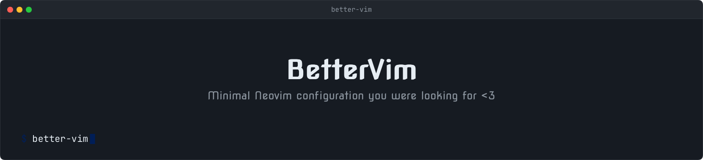

<p align="center">
  
</p>

# BetterVim

A Neovim config aimed at providing a better Neovim experience.

## 🛠️ Requirements

- Neovim 0.12+
- A Nerd Font

## ✨ Features

- Uses resession.nvim to restore project files, splits, tabs, and cursor positions.
- Restores netrw's expanded folders and selection within the project tree.
- Sessions use the Git root when available, otherwise the opened directory.
- Sticks to Neovim and plugin defaults where possible.

## 🚀 Installation

```sh
cd ~/.config/nvim
git clone https://github.com/danielsavinoff/better-vim .
rm -r .git
```
